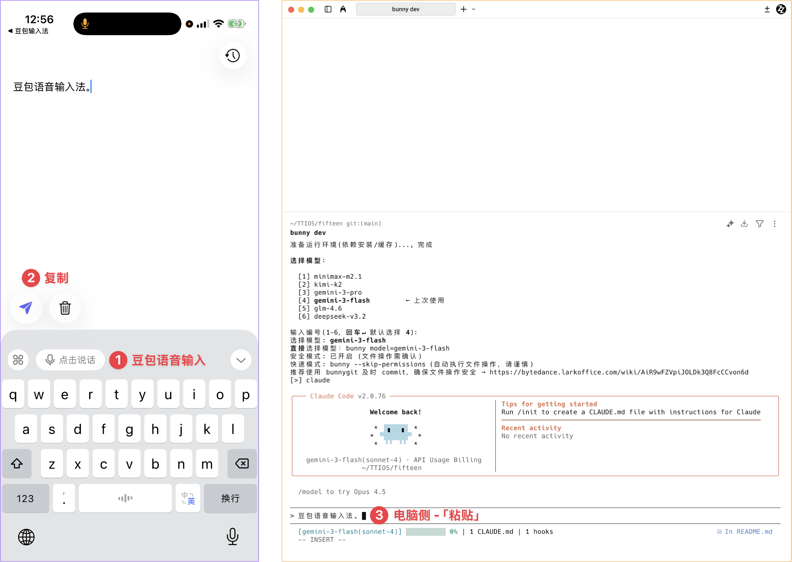

# 语音输入

## 演示



## 技术栈

- SwiftUI
- iOS 26.0+

## 开发

使用 Xcode 打开 `fifteen.xcodeproj` 即可开始开发。

也可以直接用 `make` 编译并安装到已连接的真机：

```bash
make install
```

如果连接了多台设备，可以显式指定设备名：

```bash
make install DEVICE_NAME="KAI"
```

查看当前可用真机列表：

```bash
make devices
```

## 许可证

MIT License
